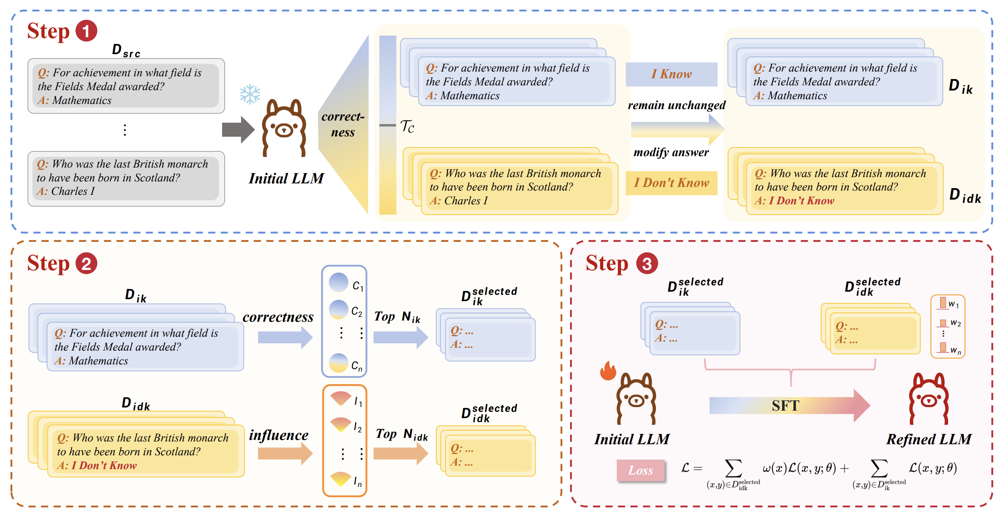

# GRAIT: Gradient-Driven Refusal-Aware Instruction Tuning for Effective Hallucination Mitigation

[](https://arxiv.org/abs/2502.05911)

## Introduction

Refusal-Aware Instruction Tuning (RAIT) enhances Large Language Models (LLMs) by improving their ability to refuse answering out-of-knowledge questions, thus reducing hallucinations while maintaining helpfulness. To tackle the dual challenges of minimizing hallucinations and avoiding over-refusal, we propose the Gradient-driven Refusal-Aware Instruction Tuning Framework (GRAIT), which selects training samples based on gradient signals to reduce hallucinations, and introduces an adaptive weighting strategy to mitigate over-refusal during fine-tuning.

<div align="center">
  
</div>

## Getting Start

### Preparing enviroment and data

Our code depends on LESS, xtuner and opencompass, so we need to set up the corresponding environment first.

```bash
## LESS
cd LESS
conda create --name less python=3.11
conda activate less
pip3 install torch==2.1.2 torchvision torchaudio
pip install -r requirement.txt
pip install -e .

## xtuner
cd xtuner
conda create --name xtuner-env python=3.10 -y
conda activate xtuner-env
pip install -e '.[all]'

## opencompass
git clone https://github.com/Zrc007/opencompass_CRaFT.git
cd opencompass
conda create --name opencompass python=3.10 -y
conda activate opencompass
pip install -e .
```

We conducted experiments on OEQA and MCQA separately. For OEQA, we used TriviaQA as the training set, with both TriviaQA and NQ as the test sets. For MCQA, MMLU was used as the training set, and ARC as the test set. We have already preprocessed these four datasets and stored them under path `dataset\preprocessed_dataset`.

### Stage 1: modify train set label

```bash
# get transet correctness
export HF_HOME = your_HF_HOME_path
set -x

HF_DATASETS_OFFLINE=1 TRANSFORMERS_OFFLINE=1 HF_EVALUATE_OFFLINE=1 \
[opencompass] PYTHONPATH=. \
python compass_config/run.py \
    compass_config/Knowledge_Query/KQ_mmlu_test_init.py \
    --dump-eval-details \
    -r \
    --max-num-workers 128

# get warmup trainset for Stage2
[opencompass] PYTHONPATH=. \
python data_process/instructions_construction/mmlu_rehearsal_instructions.py

# modify train set label
[opencompass] PYTHONPATH=. \
python data_process/instructions_construction/mmlu_RAI.py
```

### Stage 2: get data gradient
#### warm up train
If you want to perform multi-GPU training, please modify --nproc_per_node in less/scripts/train/base_training_args.sh.
```bash
[less] PYTHONPATH=. \
python zrc/code/GRAIT/data_process/get_grait_data/warmup_json2jsonl.py

DATA_DIR=dataset/rehearsal_dataset/mmlu/llama-3-8b-instruct-hf
MODEL_PATH=LLaMA3_PATH
PERCENTAGE=1
DATA_SEED=3
JOB_NAME=llama3-8b-p${PERCENTAGE}-lora-seed${DATA_SEED}

[less] ./less/scripts/train/warmup_lora_train.sh "$DATA_DIR" "$MODEL_PATH" "$PERCENTAGE" "$DATA_SEED" "$JOB_NAME"
```

#### get gradient

```bash
[less] PYTHONPATH=. \
python zrc/code/GRAIT/data_process/get_grait_data/trainset_json2jsonl.py

CKPT=12

TRAINING_DATA_NAME=MMLU_VAN
TRAINING_DATA_FILE=dataset/RAIT_dataset/mmlu/llama-3-8b-instruct-hf/VAN.jsonl # when changing data name, change the data path accordingly
GRADIENT_TYPE="adam"
MODEL_PATH=LLaMA3_PATH
OUTPUT_PATH=grads/llama3-8b-lora-seed3/${TRAINING_DATA_NAME}-ckpt${CKPT}-${GRADIENT_TYPE}
DIMS="8192"

[less] ./less/scripts/get_info/get_train_lora_grads.sh "$TRAINING_DATA_FILE" "$MODEL_PATH" "$OUTPUT_PATH" "$DIMS" "$GRADIENT_TYPE"

CKPT=12

TRAINING_DATA_NAME=MMLU_IDK
TRAINING_DATA_FILE=dataset/RAIT_dataset/mmlu/llama-3-8b-instruct-hf/IDK.jsonl # when changing data name, change the data path accordingly
GRADIENT_TYPE="adam"
MODEL_PATH=LLaMA3_PATH
OUTPUT_PATH=grads/llama3-8b-lora-seed3/${TRAINING_DATA_NAME}-ckpt${CKPT}-${GRADIENT_TYPE}
DIMS="8192"

[less] ./less/scripts/get_info/get_train_lora_grads.sh "$TRAINING_DATA_FILE" "$MODEL_PATH" "$OUTPUT_PATH" "$DIMS" "$GRADIENT_TYPE"
```

#### construct RAIT dataset
```bash
[less] PYTHONPATH=. \
python data_process/get_grait_data/construct_grait_data.py
```

### stage3: SFT
```bash
(xtuner-env) ./train/mmlu/llama3-8b/SFT.sh
(xtuner-env) ./train/mmlu/llama3-8b/convert.sh
```

## Citation

```
@article{zhu2025grait,
  title={GRAIT: Gradient-Driven Refusal-Aware Instruction Tuning for Effective Hallucination Mitigation},
  author={Zhu, Runchuan and Jiang, Zinco and Wu, Jiang and Ma, Zhipeng and Song, Jiahe and Bai, Fengshuo and Lin, Dahua and Wu, Lijun and He, Conghui},
  journal={arXiv preprint arXiv:2502.05911},
  year={2025}
}
```